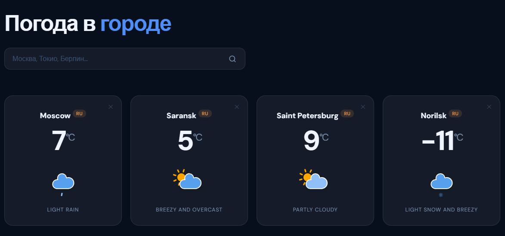

# 🌤 Weather App

Веб-приложение для просмотра текущей погоды в любом городе мира. Учебный проект с интеграцией двух REST API.

## Demo

> 🔗 [TheFlukas.github.io/weather-app](https://TheFlukas.github.io/weather-app)

## Скриншот



## Функциональность

- Поиск погоды по названию города
- Отображение температуры, иконки и описания погоды
- Несколько городов одновременно на экране
- Звуковые эффекты при добавлении карточки (Web Audio API)
- API-ключи хранятся в `localStorage` браузера — не вшиты в код
- Экран настройки при первом запуске
- Адаптивная вёрстка (mobile / tablet / desktop)

## Стек

- Vanilla JavaScript (ES6+)
- HTML5 / CSS3
- [OpenWeatherMap Geocoding API](https://openweathermap.org/api/geocoding-api) — геокодинг города по названию
- [PirateWeather API](https://pirateweather.net/) — данные о погоде
- Web Audio API — синтез звуков без внешних аудиофайлов

## Запуск

Никаких зависимостей и сборщиков — просто открой в браузере.

```bash
git clone https://github.com/TheFlukas/weather-app.git
cd weather-app
```

Затем открой `index.html` через любой локальный сервер, например [Live Server](https://marketplace.visualstudio.com/items?itemName=ritwickdey.LiveServer) в VS Code.

> ⚠️ Открывать напрямую через `file://` не рекомендуется — браузеры могут блокировать fetch-запросы к API.

## Настройка API-ключей

При первом открытии приложение покажет экран настройки. Введи свои ключи — они сохранятся в `localStorage` и больше не понадобятся.

| Сервис | Регистрация | Бесплатный план |
|---|---|---|
| OpenWeatherMap | [openweathermap.org](https://home.openweathermap.org/users/sign_up) | 1 000 запросов/день |
| PirateWeather | [pirateweather.net](https://pirate-weather.apiable.io/products/weather-data/plans) | 20 000 запросов/месяц |

## Структура проекта

```
weather-app/
├── icons/
│   ├── animated/   # SVG-иконки с анимацией
│   └── static/     # Статичные SVG-иконки
├── index.html
├── script.js
├── styles.css
└── README.md
```

## Автор

[TheFlukas](https://github.com/TheFlukas)
